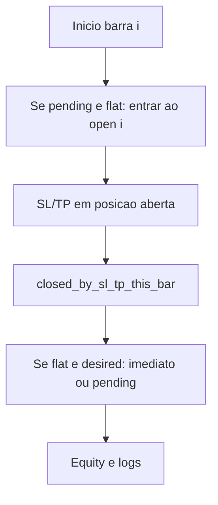

# Plano: corrigir re-entrada ao `curr_open` após SL/TP (CNN_ETH)

## Problema

Em [`CNN_ETH/backtest/main.ipynb`](CNN_ETH/backtest/main.ipynb), a função `trading_backtest` faz, por cada barra `i`:

1. Testa SL/TP contra `curr_high` / `curr_low`.
2. Se `position == 0` e `desired != 0`, entra em `entry_price = curr_open`.

Se o passo 1 fechar por SL/TP **na mesma barra**, o passo 2 ainda pode executar com o **mesmo** `curr_open` — mas esse open ocorreu **antes** do toque de SL/TP ao longo da barra. Isto é o mini-lookahead que identificaste.

## Comportamento desejado (sem lookahead)

- **Regra**: Só é permitida entrada ao `curr_open` da barra `i` se **não** tiveres acabado de sair por SL/TP **nessa** barra `i`.
- **Implementação padrão**: manter uma variável `pending_entry` (`None`, `1` ou `-1`):
  - No **início** da iteração `i` (antes de SL/TP): se `position == 0` e `pending_entry is not None`, executar a mesma lógica de entrada (fee + `entry_price = curr_open` + `position = pending_entry`) e limpar `pending_entry`.
  - Depois do bloco SL/TP: definir `closed_by_sl_tp_this_bar = True` apenas quando `realize_to` for chamado por SL ou TP (não quando outro fluxo fechar no futuro).
  - No bloco `if position == 0 and desired != 0`:
    - Se `closed_by_sl_tp_this_bar`: `pending_entry = desired` (não entra ao `curr_open` nesta barra).
    - Caso contrário: entrada imediata ao `curr_open` (comportamento actual para sinais “normais”).

## Detalhes de implementação

- **Ficheiro principal**: uma célula de código em [`CNN_ETH/backtest/main.ipynb`](CNN_ETH/backtest/main.ipynb) que contém a definição completa de `trading_backtest` (por volta das linhas ~662–770 do JSON, conforme a versão actual).
- **Estado extra**: `pending_entry: int | None = None` inicializado antes do `for i in range(n)`.
- **Flags**: `closed_by_sl_tp_this_bar = False` no início de cada iteração; `True` após `realize_to` disparado pelo ramo SL ou TP (não misturar com outros fechos se no futuro existirem).
- **Fim da série**: se após o loop ainda existir `pending_entry` e `position == 0`, **descartar** o pending (não inventar preço “futuro” no último candle) — documentar na célula ou num comentário curto; é conservador e evita novo viés.

## Documentação

- Acrescentar 2–3 frases na célula markdown **junto ao SL/TP** (já existe texto sobre heatmap e unidades) ou em [`CNN_ETH/backtest/HEATMAP.md`](CNN_ETH/backtest/HEATMAP.md) se existir: explicar que, após saída por SL/TP, a nova entrada só pode ocorrer no **open da barra seguinte** (ou via fila `pending_entry`).

## Verificação manual

- Após alterar, re-executar as células que definem `trading_backtest` e as que chamam `equities_selection` / `equities_holdout` com `BEST_SL` / `BEST_TP` fixos.
- **Esperado**: equity final e contagens (`entries`, `sl_hits`, `tp_hits`) podem mudar ligeiramente; o objectivo é **remover** o preço de entrada impossível, não manter o mesmo PnL.

## Outros repositórios (opcional)

- [`PORTFOLIO/backtest_4pairs/main.ipynb`](PORTFOLIO/backtest_4pairs/main.ipynb) declara lógica “idêntica” ao `trading_backtest` single-pair; o mesmo padrão `pending_entry` aplica-se se quiseres consistência entre projectos.
- Outros notebooks `CNN_*/backtest/main.ipynb` (LINK, PAXG, SOL, XRP, `CNN`) são cópias do mesmo padrão — só se quiseres alinhar tudo de uma vez; o pedido foca **principalmente** CNN_ETH.
