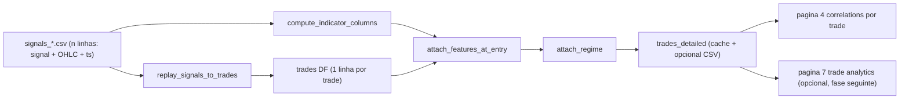

## Trades-Detailed Foundation + Correlations por Trade

### 1. Diagrama de fluxo

### 2. Arquitetura — dashboard pós-processamento

Tudo dentro de `dashboard/utils/`. Reusa o motor através do `_align_ohlc_for_engine` já existente em [`dashboard/utils/backtest_lite.py`](dashboard/utils/backtest_lite.py) para garantir paridade bit-exata. **Não toca em `INF/`.**

### 3. Novo módulo `dashboard/utils/trades.py`

`TradeRecord` (dataclass) e `replay_signals_to_trades`:

- Replica o loop de [`INF/backtest_engine.py:139-209`](INF/backtest_engine.py) mas, em vez de equity, agrega eventos por trade (entry / sl_hit / tp_hit / eos).
- Saída: `pd.DataFrame` com colunas `window_id, split, entry_idx, exit_idx, entry_ts, exit_ts, position, entry_price, exit_price, pnl_gross, fees, pnl_net, exit_reason, bars_in_trade, signal_at_entry, abs_signal_at_entry, sl, tp, trailing_stop, signal_threshold, taker_fee, position_notional`.
- `pending_entry` resolve-se na barra seguinte exatamente como o engine.
- A função recebe um `signals_df` mais `(sl, tp, threshold, trailing, taker_fee, position_notional)` e devolve sempre o mesmo número de trades que `BacktestResult.completed_trades + (1 se posição aberta no fim)`, garantindo paridade.

### 4. Regime tracking — `dashboard/utils/regime.py`

- `compute_regime_features(ohlc_df)` calcula `ATR_14`, `ATR_200`, `atr_ratio = ATR_14 / ATR_200` (reusa [`dashboard/utils/indicators.py`](dashboard/utils/indicators.py) onde possível).
- `classify_regime(values, *, low_thr=0.8, high_thr=1.2)` devolve label int + nome (`low_vol`, `mid_vol`, `high_vol`).
- Configurável: dict opcional permite alargar para outros indicadores (ex.: trend strength via ADX) sem refactor maior.

### 5. Junção features+regime — `dashboard/utils/trades.py`

- `attach_features_at_entry(trades_df, signals_df, indicators)`: computa indicadores em todo o `signals_df` e faz `merge` por `entry_idx`. Indicadores default: `ATR_14`, `ATR_200`, `RSI_14`, `MACD_hist`, `volume`.
- `attach_regime(trades_df, signals_df)`: chama `compute_regime_features` + `classify_regime` e adiciona colunas `regime_label, regime_name, atr_ratio_at_entry`.

### 6. Cache + opcional dump

- Wrapper `build_trades_detailed(window_dir, split, sl, tp, thr, trail, ...)` cached com `@st.cache_data` (chave inclui parâmetros).
- Botão na página 4 para escrever `trades_detailed_<split>_sl{sl}_tp{tp}_thr{thr}_trail{trail}.csv` em `window_dir`.

### 7. Parity test — `dashboard/tests/test_trades_replay.py`

- Lê um `signals_*.csv` real (ex.: a janela usada na correção bit-exata) e o `metrics.csv` correspondente.
- Replay com (sl, tp, thr, trail) iguais. Asserts:
  - `len(trades)` ≈ `entries` em metrics.csv
  - `sum(trades.pnl_net)` corresponde a `final_equity - position_notional` (tolerância 1e-6)
  - `(trades.exit_reason=='sl').sum() == sl_hits` e idem para `tp_hits`

Isto trava regressões da paridade engine/replay sem precisar de tocar no `INF`.

### 8. Refactor página 4 — [`dashboard/pages/4_correlations.py`](dashboard/pages/4_correlations.py)

Substituir o atual “média de indicador por janela vs ROI” por:

- Selecção: `run_id`, `experiment`, e múltiplos `window_id` (ou “all windows”).
- Selecção de SL/TP/thr/trail (pré-preenchido com `is_best=True` se existir, ou com defaults do `config.resolved.yaml`).
- Build do trades_detailed para cada janela seleccionada e concatena.
- Selecção de indicador alvo + tipo de binning (tertis automáticos / cortes fixos / quintis).
- Visualização:
  - tabela com `n_trades, win_rate, avg_pnl, expectancy, sharpe_local` por bin
  - gráfico de barras winrate por bin com erro padrão
  - boxplot de PnL por bin
  - filtro opcional por `regime_name`
- Cabeçalho com avisos: indica nº trades por bin (descarta bins com n<10) para evitar overfit.

### 9. Migração da página 3 (sem alterar comportamento)

Apenas para reduzir duplicação: mover a função interna que já replica o backtest no `backtest_lite.run_grid` para usar o novo `replay_signals_to_trades` + agregação. Não muda o output do heatmap; só garante que existe **uma** implementação pós-processada.

### 10. Sequência de entrega (PRs sugeridos)

1. `trades.py` + `regime.py` + parity test (sem mudar UI nenhuma).
2. Refactor da página 4.
3. (Opcional, fase seguinte) páginas Trade Analytics / Regime Breakdown / Signal Quality.

### 11. Riscos e mitigações

- **Duplicação de lógica engine↔replay**: o parity test do passo 7 detecta divergência imediata.
- **Performance**: replay puro Python por janela é ~1k bars × 3-4 ops; ms. Cache evita recomputar quando o utilizador muda só o indicador a analisar.
- **Triple-barrier val**: já tratado upstream (mask aplicada antes de gravar `signals_val.csv`), portanto não precisa de tratamento especial aqui.
- **`window_id`/`split` nos trades**: o `signals.csv` já guarda `eval_split`; `window_id` deduz-se do nome do diretório.