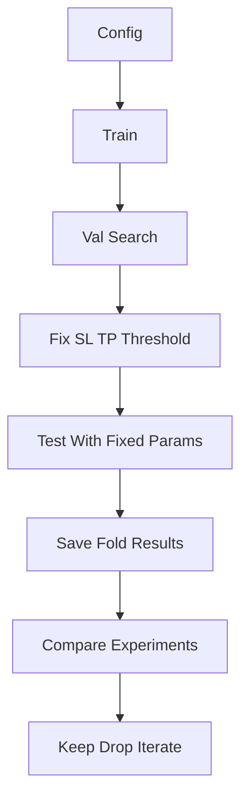

# Checklist Walk-Forward E Iteração

Este documento é uma checklist de trabalho, não um pedido para implementar tudo de uma vez. A ideia é escolher um bloco, implementar, validar, registar o resultado e só depois avançar.

## Objetivo

Criar um workflow onde cada experiência seja reproduzível, honesta em termos de validação/teste, fácil de comparar e útil para decidir a próxima iteração.

## Estado Atual

- `[INF/run_walkforward.py](INF/run_walkforward.py)` já treina por janela, faz ensemble de checkpoints e escolhe o melhor SL/TP por `backtest.grid_select_metric`.
- `[INF/data_loader.py](INF/data_loader.py)` já suporta `walkforward.test_size`, mas `[INF/config.yaml](INF/config.yaml)` está com `test_size: null`, portanto hoje a avaliação final cai na validação.
- `[INF/config.yaml](INF/config.yaml)` já tem `training.seed`, `checkpoint_metric: val_equity` e `grid_select_metric: sharpe`.
- O threshold ainda é único (`backtest.signal_threshold`), não faz parte do grid de validação.
- `[INF/features.py](INF/features.py)` ainda tem features fixas, sem catálogo por nome para ablation studies.

## Fluxo-Alvo

## Checklist Por Blocos

### Bloco 0 — Baseline E Segurança

- [ ] Guardar/identificar um run baseline atual para comparação.
- [ ] Confirmar comando usado para correr o walk-forward.
- [ ] Confirmar dataset/par/timeframe do baseline.
- [ ] Confirmar seed usada.
- [ ] Confirmar quantas janelas/folds são executadas.
- [ ] Confirmar métrica atual de seleção: `backtest.grid_select_metric`.
- [ ] Resultado esperado: sabemos exatamente contra que output vamos comparar qualquer alteração.

### Bloco 1 — Separar Validação E Teste

- [ ] Definir `walkforward.test_size` em `[INF/config.yaml](INF/config.yaml)`.
- [ ] Garantir que cada fold tem `train`, `val` e `test` reais.
- [ ] Manter grid search apenas na `val`.
- [ ] Aplicar no `test` apenas os parâmetros escolhidos na `val`.
- [ ] Guardar `eval_split` ou equivalente de forma explícita nos outputs.
- [ ] Resultado esperado: o test deixa de ser usado para escolher parâmetros.

### Bloco 2 — Fixar SL/TP/Threshold Na Val

- [ ] Adicionar `threshold_values` ao config.
- [ ] Fazer o grid search em `(sl, tp, threshold)`.
- [ ] Substituir a seleção de apenas `(sl, tp)` por seleção de `(sl, tp, threshold)`.
- [ ] Guardar por fold: `best_sl`, `best_tp`, `best_threshold`, `best_score`.
- [ ] Manter `grid_select_metric` no config para não hardcodear a decisão.
- [ ] Resultado esperado: nenhum ajuste manual de threshold ou SL/TP no test.

### Bloco 3 — Métricas Agregadas De Test

- [ ] Criar agregação de métricas por fold em `[INF/metrics.py](INF/metrics.py)`.
- [ ] Calcular `mean_equity`.
- [ ] Calcular `median_equity`.
- [ ] Calcular `pct_profitable`.
- [ ] Calcular `mean_sharpe`.
- [ ] Calcular `mean_max_drawdown`.
- [ ] Calcular `mean_win_rate`.
- [ ] Calcular `worst_fold_equity`.
- [ ] Calcular `best_fold_equity`.
- [ ] Calcular `equity_std`.
- [ ] Usar `position_notional` como breakeven, não `1000` hardcoded.
- [ ] Resultado esperado: cada run tem uma leitura agregada clara de consistência.

### Bloco 4 — Reporter De Leitura Rápida

- [ ] Criar tabela comparativa com métricas `val_*` e `test_*`.
- [ ] Guardar `comparison.csv`.
- [ ] Guardar `fold_results.csv`.
- [ ] Guardar `selected_params.csv`.
- [ ] Criar gráfico `equity_by_fold.png` com `val` vs `test`.
- [ ] Ordenar a comparação por métricas de test, não por validação.
- [ ] Resultado esperado: conseguimos decidir rapidamente se uma config melhorou ou só overfitou.

### Bloco 5 — Loop De Experiments

- [ ] Adicionar suporte a `experiments:` no config.
- [ ] Cada experiment deve ter `name`.
- [ ] Cada experiment pode ter `features`.
- [ ] Cada experiment pode ter `epochs`.
- [ ] Cada experiment pode ter `sl_values`.
- [ ] Cada experiment pode ter `tp_values`.
- [ ] Cada experiment pode ter `threshold_values`.
- [ ] Os blocos globais continuam como defaults.
- [ ] Preservar compatibilidade com config antigo sem `experiments`.
- [ ] Resultado esperado: correr várias configs sem editar código entre runs.

### Bloco 6 — Feature Catalog Para Ablation

- [ ] Criar catálogo de features por nome em `[INF/features.py](INF/features.py)`.
- [ ] Começar pelas features atuais com nomes estáveis.
- [ ] Garantir que a primeira feature continua a ser o canal previsto pelo modelo.
- [ ] Validar configs do tipo `base`, `+rsi_14`, `+atr_14`, `+all`.
- [ ] Bloquear features desconhecidas com erro claro.
- [ ] Resultado esperado: feature selection passa a ser configurável e auditável.

### Bloco 7 — Checklist De Experiência

- [ ] Definir pergunta da experiência antes de correr.
- [ ] Exemplo: “RSI melhora consistência OOS face ao baseline?”
- [ ] Usar mesmo dataset.
- [ ] Usar mesma seed.
- [ ] Usar mesmos folds.
- [ ] Usar mesmos epochs.
- [ ] Usar mesma arquitetura.
- [ ] Comparar primeiro `test_pct_profitable`.
- [ ] Comparar depois `test_mean_eq`.
- [ ] Confirmar que `test_mean_dd` não piorou materialmente.
- [ ] Registar decisão: `keep`, `drop`, `neutral`, ou `rerun`.

## Critérios De Decisão

- [ ] Manter feature/config se melhora `test_pct_profitable` e não aumenta demasiado o drawdown.
- [ ] Tratar aumento de `mean_equity` com queda de `pct_profitable` como suspeito.
- [ ] Repetir no segundo par antes de considerar uma feature robusta.
- [ ] Não avançar para gestão de risco se ainda não houver sinal OOS consistente.
- [ ] Não mexer em arquitetura se o problema atual for medição/validação.

## Ordem Recomendada De Execução

1. Fazer Bloco 0.
2. Fazer Bloco 1.
3. Fazer Bloco 2.
4. Fazer Bloco 3.
5. Fazer Bloco 4.
6. Só depois fazer Bloco 5.
7. Só depois fazer Bloco 6.
8. Usar Bloco 7 em todas as experiências futuras.

## Não Fazer Ainda

- [ ] Não implementar FVGs/order blocks antes de estabilizar o workflow.
- [ ] Não implementar position sizing dinâmico antes de ter sinal OOS.
- [ ] Não comparar features com números de epochs diferentes.
- [ ] Não escolher threshold olhando para o test.
- [ ] Não decidir por melhor fold isolado.