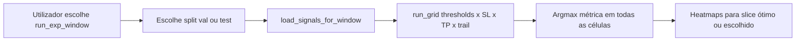

# Plano: sweep threshold + SL/TP no **dashboard** (split de validação)

> **Âmbito:** implementação em [`dashboard/pages/3_sl_tp_heatmap.py`](../dashboard/pages/3_sl_tp_heatmap.py) e utilitários do dashboard. **Não** alterar o pipeline `INF/run_walkforward.py` para este objetivo — o walk-forward continua a gerar `signals_val.csv` / `signals_test.csv` / `signals.csv` como hoje.

## Objetivo

Na página **SL/TP heatmap** (mapa SL × TP):

1. Oferecer uma opção explícita para correr o grid sobre o **split de validação da janela** (`signals_val.csv`), em vez de usar apenas o ficheiro “principal” (`signals.csv`, que normalmente espelha o **teste** quando existe `test_size`).
2. Sobre esse split (val), avaliar o produto **threshold × SL × TP × trailing** (os eixos já suportados por [`dashboard/utils/backtest_lite.py::run_grid`](../dashboard/utils/backtest_lite.py) — o motor é o mesmo do INF).
3. Apresentar a **combinação ótima na validação** segundo uma métrica escolhida no UI (ex.: Sharpe, equity final, robustness — alinhado ao que já calcula `CellMetrics`).

Assim consegues estudar thresholds e SL/TP **offline**, sem re-treinar nem mudar o YAML do sweep no pipeline.

## Porquê no dashboard

- Os **sinais na val** já estão gravados por janela (`signals_val.csv`); o backtest “lite” já é **bit-exato** com o INF quando fee/notional/threshold alinham (ver docstring em `backtest_lite.py`).
- Evita inflar cada run com milhares de linhas em `metrics.csv` e mantém o walk-forward rápido e comparável entre versões antigas e novas.

## Estado atual (gaps)

- A página carrega só [`load_signals` → `signals.csv`](../dashboard/utils/loader.py).
- Após `run_grid`, o UI só desenha heatmap para **o primeiro** `(threshold, trailing)` e o “best” é só sobre SL/TP nesse slice — **ignora** o resto dos thresholds/trails mesmo quando o utilizador passa lista.

## Comportamento desejado (UI)

1. **Origem dos dados**
   - Controlo: *“Split: Validação (`signals_val`) / Teste (`signals` ou `signals_test`)*” — ou equivalente (radio / select).
   - Se `signals_val.csv` não existir na pasta da janela, mostrar aviso claro (janela antiga / run incompleto).

2. **Grids (já na página ou ligeiramente estendidos)**
   - SL / TP: min, max, step (como hoje).
   - Threshold: lista por vírgulas **e/ou** opção “range” `min / max / step` (opcional; pode ser follow-up mínimo gerando a mesma lista que `np.arange`).
   - Trailing: lista por vírgulas (como hoje).

3. **Métrica de otimização**
   - Selectbox: `Sharpe` | `Final equity` | `Robustness` (reaproveitar campos de `CellMetrics`).

4. **Resultado**
   - Depois de `run_grid(...)`, iterar **todas** as chaves `(sl, tp, thr, trail)` no dict e escolher o máximo segundo a métrica (tratar `NaN`).
   - Mostrar bloco **“Ótimo na validação (nesta janela)”**: `{ threshold, sl, tp, trailing_stop, métrica, valor }`.
   - **Heatmaps:** ou (A) heatmaps para o par `(thr, trail)` **óptimo** encontrado, ou (B) permitir escolher um `(thr, trail)` no sidebar e atualizar heatmaps — recomendação: (A) por defeito + dropdown para explorar outros slices.

5. **Export**
   - Manter / melhorar o snippet YAML `backtest:` com os **quatro** valores ótimos.

## Alterações de código (ficheiros)

| Ficheiro | Alteração |
|----------|-----------|
| [`dashboard/utils/loader.py`](../dashboard/utils/loader.py) | Função `load_signals_for_window(window_dir, split: "val" \| "test" \| "primary")` que lê `signals_val.csv`, `signals_test.csv`, ou `signals.csv` conforme o caso; reutilizar cache `@st.cache_data` por path. |
| [`dashboard/pages/3_sl_tp_heatmap.py`](../dashboard/pages/3_sl_tp_heatmap.py) | Split selector; carregar o CSV certo; após `run_grid`, **best global** sobre `(sl,tp,thr,trail)` + métrica; heatmaps alinhados ao slice óptimo ou selecionado; título/caption a indicar qual split está activo. |
| [`dashboard/utils/backtest_lite.py`](../dashboard/utils/backtest_lite.py) | *Opcional:* helper `find_best_cell(out, metric="sharpe")` para evitar duplicar lógica na página (pure function, sem Streamlit). |

**Não obrigatório para o MLP:** mudanças em `INF/*`, novos configs YAML, ou testes pytest (podem ser smoke manuais no Streamlit).

## Fluxo (resumo)

## Custo e UX

- `run_grid` já faz um `run_backtest_grid` **por** `(threshold, trailing)`; o custo é `n_thr × n_trail × n_sl × n_tp` backtests. Para ranges grandes, usar `st.spinner` + aviso na UI (“grid grande pode demorar”).
- Opcional: botão “Dry run: contar combinações” antes de executar.

## Nota sobre overfitting

Optimizar threshold **e** SL/TP na **mesma** fatia de validação da mesma janela aumenta risco de ajuste à amostra. O dashboard serve para **exploração**; para conclusões fortes, repetir o mesmo critério em várias janelas / agregar por `run_id`.

## Legado deste documento

Versões anteriores deste plano descreviam sweep **dentro** do `run_walkforward.py`. Esse caminho fica **fora de âmbito**; a fonte de verdade para o sweep interactivo passa a ser esta página do dashboard.
