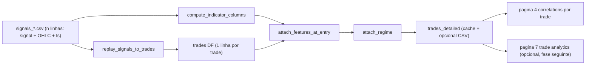

## Trades-Detailed Foundation + Correlations por Trade

### 1. Diagrama de fluxo



### 2. Arquitetura — dashboard pós-processamento

Tudo dentro de `dashboard/utils/`. Reusa o motor através do `_align_ohlc_for_engine` já existente em [`dashboard/utils/backtest_lite.py`](dashboard/utils/backtest_lite.py) para garantir paridade bit-exata. **Não toca em `INF/`.**

### 3. Novo módulo `dashboard/utils/trades.py`

`TradeRecord` (dataclass) e `replay_signals_to_trades`:

- Replica o loop de [`INF/backtest_engine.py:139-209`](INF/backtest_engine.py) mas, em vez de equity, agrega eventos por trade (entry / sl_hit / tp_hit / eos).
- Saída: `pd.DataFrame` com colunas `window_id, split, entry_idx, exit_idx, entry_ts, exit_ts, position, entry_price, exit_price, pnl_gross, fees, pnl_net, exit_reason, bars_in_trade, signal_at_entry, abs_signal_at_entry, sl, tp, trailing_stop, signal_threshold, taker_fee, position_notional`.
- `pending_entry` resolve-se na barra seguinte exatamente como o engine.
- A função recebe um `signals_df` mais `(sl, tp, threshold, trailing, taker_fee, position_notional)` e devolve sempre o mesmo número de trades que `BacktestResult.completed_trades + (1 se posição aberta no fim)`, garantindo paridade.

### 4. Regime tracking — `dashboard/utils/regime.py`

- `compute_regime_features(ohlc_df)` calcula `ATR_14`, `ATR_200`, `atr_ratio = ATR_14 / ATR_200` (reusa [`dashboard/utils/indicators.py`](dashboard/utils/indicators.py) onde possível).
- `classify_regime(values, *, low_thr=0.8, high_thr=1.2)` devolve label int + nome (`low_vol`, `mid_vol`, `high_vol`).
- Configurável: dict opcional permite alargar para outros indicadores (ex.: trend strength via ADX) sem refactor maior.

### 5. Junção features+regime — `dashboard/utils/trades.py`

- `attach_features_at_entry(trades_df, signals_df, indicators)`: computa indicadores em todo o `signals_df` e faz `merge` por `entry_idx`. Indicadores default: `ATR_14`, `ATR_200`, `RSI_14`, `MACD_hist`, `volume`.
- `attach_regime(trades_df, signals_df)`: chama `compute_regime_features` + `classify_regime` e adiciona colunas `regime_label, regime_name, atr_ratio_at_entry`.

### 6. Cache + opcional dump

- Wrapper `build_trades_detailed(window_dir, split, sl, tp, thr, trail, ...)` cached com `@st.cache_data` (chave inclui parâmetros).
- Botão na página 4 para escrever `trades_detailed_<split>_sl{sl}_tp{tp}_thr{thr}_trail{trail}.csv` em `window_dir`.

### 7. Parity test — `dashboard/tests/test_trades_replay.py`

- Lê um `signals_*.csv` real (ex.: a janela usada na correção bit-exata) e o `metrics.csv` correspondente.
- Replay com (sl, tp, thr, trail) iguais. Asserts:
  - `len(trades)` ≈ `entries` em metrics.csv
  - `sum(trades.pnl_net)` corresponde a `final_equity - position_notional` (tolerância 1e-6)
  - `(trades.exit_reason=='sl').sum() == sl_hits` e idem para `tp_hits`

Isto trava regressões da paridade engine/replay sem precisar de tocar no `INF`.

### 8. Refactor página 4 — [`dashboard/pages/4_correlations.py`](dashboard/pages/4_correlations.py)

Substituir o atual “média de indicador por janela vs ROI” por:

- Selecção: `run_id`, `experiment`, e múltiplos `window_id` (ou “all windows”).
- Selecção de SL/TP/thr/trail (pré-preenchido com `is_best=True` se existir, ou com defaults do `config.resolved.yaml`).
- Build do trades_detailed para cada janela seleccionada e concatena.
- Selecção de indicador alvo + tipo de binning (tertis automáticos / cortes fixos / quintis).
- Visualização:
  - tabela com `n_trades, win_rate, avg_pnl, expectancy, sharpe_local` por bin
  - gráfico de barras winrate por bin com erro padrão
  - boxplot de PnL por bin
  - filtro opcional por `regime_name`
- Cabeçalho com avisos: indica nº trades por bin (descarta bins com n<10) para evitar overfit.

### 9. Migração da página 3 (sem alterar comportamento)

Apenas para reduzir duplicação: mover a função interna que já replica o backtest no `backtest_lite.run_grid` para usar o novo `replay_signals_to_trades` + agregação. Não muda o output do heatmap; só garante que existe **uma** implementação pós-processada.

### 10. Sequência de entrega (PRs sugeridos)

1. `trades.py` + `regime.py` + parity test (sem mudar UI nenhuma).
2. Refactor da página 4.
3. (Opcional, fase seguinte) páginas Trade Analytics / Regime Breakdown / Signal Quality.
4. **+fv** Infra partilhada (`state.py`, `robustness.py`, extensão `regime.py`) + páginas `2b` / `2c` / `2d` (ver secção 12).

### 12. +fv — Três análises distintas (estrutura de páginas)

Objectivo: o documento separa claramente três perguntas complementares; o fluxo de investigação sugerido é **C → B → A**.

| Página | Ficheiro | Pergunta |
|--------|----------|----------|
| **A** — *Threshold Analyzer* | `dashboard/pages/2b_threshold_analyzer.py` | Nesta janela, que threshold funcionou e porquê? |
| **B** — *Multi-window Settings Comparator* | `dashboard/pages/2c_settings_comparator.py` | Este setting é consistentemente melhor que aquele, ou só numa janela? |
| **C** — *Robustness Surface* | `dashboard/pages/2d_robustness_surface.py` | Qual a zona do espaço (threshold × SL × TP × trail) robusta *across* todas as janelas? |

**Complementaridade no workflow**

- **Página C** — ponto de partida: zona robusta do espaço de parâmetros e regime onde falha (ex.: “usa thr=0.010, SL=50, TP=100, evita high_vol”).
- **Página B** — confirma que esse setting domina alternativas em mais janelas; identifica janelas problemáticas onde nenhum setting funciona.
- **Página A** — forense numa janela problemática: equity por threshold + ATR ratio (e outros indicadores); fecha o loop (regime não tradeable vs modelo).

**Regras transversais (plano técnico)**

- Três páginas novas em `dashboard/pages/`. Sidebar comum via `dashboard/utils/state.py`.
- **Replay**: usar `INF.backtest_engine.run_single_backtest()` directamente — não reimplementar lógica de motor.
- **Indicadores**: `dashboard/utils/indicators.py`.
- **Cache**: `st.cache_data` em cargas e replays pesados.
- **Navegação**: as três páginas escrevem `session_state` (`run_id`, `experiment`, `window_id`) em interacções; clique numa janela em B ou C prepara abertura correcta na página A.

---

### 12.1 Página A — `2b_threshold_analyzer.py` (*Threshold Analyzer*)

**Propósito:** uma janela; sobrepor curvas de equity para vários thresholds e correlacionar com indicadores de regime.

**Sidebar:** `run_id`, `experiment`, `window_id` (ordenar *worst-first* por ROI em `runs_summary`), `split` (val/test), `threshold_values` (texto, default `0.001,0.003,0.005,0.007,0.008,0.010,0.012`), `sl_points`, `tp_points`, `trailing_stop` (valores únicos; defaults de `config.resolved.yaml`), multiselect `overlay_indicators`: `ATR_ratio`, `RSI_14`, `MACD_hist`, `Vol20`.

**Dados:** `signals_{split}.csv` por janela via `load_signals_for_window()`; `config.resolved.yaml`; slice OHLCV para indicadores.

**Replay (cached por janela + params):** para cada threshold, `run_single_backtest(...)` → guardar `equity_curve` (comprimento = n_bars), `final_equity`, sharpe, max_dd, n_trades, tp_hits, sl_hits. `buy_and_hold = position_notional * (close / close[0])`.

**Chart 1 — Equity (plotly, height=300):** linhas com gradiente vermelho→verde por `final_equity`; buy&hold cinza tracejado; todos a iniciar em `position_notional`; hover: threshold, equity na barra, ROI% cumulativo; legenda `thr={x} | ROI={y}% | n={z}`.

**Chart 2 — Painel de indicadores (plotly, height=150, eixo X partilhado):** ATR_ratio com bandas h em 0.8 (verde) e 1.2 (vermelho); RSI_14 com 30/70; MACD_hist barras verde/vermelho por sinal; Vol20 em eixo Y secundário; só os seleccionados.

**Tabela de métricas:** colunas thr | ROI% | sharpe | max_dd | n_trades | tp_hits | sl_hits; ordenar por sharpe desc.; destacar melhor linha.

**Auto insight (texto):** threshold óptimo, ROI, n_trades; “ATR regime” (nome + avg ratio); quantos thresholds positivos nesta janela.

---

### 12.2 Página B — `2c_settings_comparator.py` (*Multi-window Settings Comparator*)

**Propósito:** comparar vários `(thr, sl, tp, trail)` em várias janelas; ver dominância e regime que explica diferenças.

**Sidebar:** `run_id`, `experiment`, multiselect `window_ids` (default todas, máx. 24), `split`. Lista de settings (até 6): cada um `(thr, sl, tp, trail)` com 4 text inputs + botão “Add setting”; pré-preencher 3 defaults do config.

**Replay (cached por run+experiment+split):** para cada `(window_id, setting)`, `run_single_backtest` → métricas incl. `equity_curve`.

**Chart 1 — ROI por janela por setting:** barras agrupadas; eixo X `window_id` cronológico; linha y=0; clique na barra → `session_state.selected_window` (link à página A).

**Chart 2 — Heatmap de delta (setting A vs B):** selectboxes A/B; eixo X janelas, eixo Y métricas (ROI, sharpe, max_dd); verde=A ganha, vermelho=B ganha, intensidade = magnitude do delta.

**Chart 3 — Regime por janela:** ATR_ratio médio no período da janela; classificar low_vol / mid_vol / high_vol; faixa colorida acima do eixo X do chart 1.

**Tabela agregada por setting:** avg_roi, avg_sharpe, avg_dd, pct_windows_positive, pct_windows_best (maior sharpe entre todos os settings).

**Auto insight:** setting que mais ganha; regime onde domina; piores janelas para *todos* os settings.

---

### 12.3 Página C — `2d_robustness_surface.py` (*Robustness Surface*)

**Propósito:** zona robusta em (threshold × SL × TP × trail) — combinações que aparecem consistentemente no quartil superior entre janelas, não só o melhor numa janela.

**Sidebar:** `run_id`, `experiment`, `split`, text inputs `thr_values`, `sl_values`, `tp_values`, `trail_values` (defaults no spec), botão **“Compute robustness surface”** (caro; cache por hash de parâmetros).

**Computação — `dashboard/utils/robustness.py` → `compute_robustness_surface(run_id, experiment, split, thr_values, sl_values, tp_values, trail_values)` → DataFrame:**

- Por janela, por cada ponto da grelha: `run_single_backtest` → sharpe, roi, max_dd, n_trades; `rank_pct` = percentil de sharpe *dentro* dos resultados dessa janela na grelha.
- Agregar por combinação: avg_sharpe, avg_roi, avg_dd; pct_positive (% janelas com sharpe > 0); pct_top_quartile (% janelas com rank_pct ≥ 0.75); **robustness** = avg_sharpe × pct_top_quartile (métrica principal de ordenação).
- Juntar ATR_ratio por janela para análise de regime.

**Chart 1 — Tabela top-10:** colunas thr | sl | tp | trail | avg_sharpe | avg_roi | avg_dd | pct_positive | pct_top_quartile | robustness; ordenar por robustness; destacar topo.

**Chart 2 — Heatmap robustness (thr × SL):** fixar TP e trail (top-1 por defeito; selectboxes para override); cor = robustness; anotação `{pct_top_quartile:.0%}` por célula.

**Chart 3 — Fan chart (top-5 combos):** eixo X janelas; por combo: linha central = sharpe por janela; banda sombreada ±0.5 std (simples, não P25/P75).

**Chart 4 — Regime para top-1:** sharpe por janela do melhor combo agregado por regime ATR (low/mid/high_vol); barras avg_sharpe por regime (base empírica para filtro ATR).

**Auto insight:** combinação top-quartil em X% das janelas; performance por regime; **Suggested ATR filter:** `filter_threshold` = valor de ATR_ratio acima do qual avg_sharpe do top combo passa a negativo (auto-computado).

---

### 12.4 Infra partilhada (resumo)

- **`dashboard/utils/robustness.py`:** `compute_robustness_surface(...)` conforme 12.3.
- **`dashboard/utils/regime.py`:** se ainda não existir como tal, expor `compute_atr_ratio(ohlcv_df, fast=14, slow=200)` e `classify_regime(atr_ratio, low_thr=0.8, high_thr=1.2)` (alinhado com secção 4 deste doc onde `compute_regime_features` já define ratio/bandas).

**Nota de consistência com secções 2–4:** a fundação *trades_detailed* pode continuar a usar replay dedicado em `trades.py` para paridade por-trade; as **páginas +fv** seguem explicitamente `run_single_backtest` para equity/métricas agregadas por janela, evitando duplicar regras de execução do motor.

---

### 12.5 Prompt consolidado (referência para implementação futura)

```
Create three new Streamlit pages in dashboard/pages/. All share the same
sidebar infrastructure via dashboard/utils/state.py.

All replay computations use INF.backtest_engine.run_single_backtest()
directly — never reimplement the logic. All indicator computations use
dashboard/utils/indicators.py. All use st.cache_data.

════════════════════════════════════════════════════════════════
PAGE A: dashboard/pages/2b_threshold_analyzer.py
════════════════════════════════════════════════════════════════

PURPOSE: For a single window, overlay equity curves for multiple
threshold values and correlate with market regime indicators.

SIDEBAR CONTROLS:
- selectbox: run_id
- selectbox: experiment
- selectbox: window_id (sorted worst-first by ROI from runs_summary)
- selectbox: split (val/test)
- text_input: threshold_values (default "0.001,0.003,0.005,0.007,0.008,0.010,0.012")
- text_input: sl_points (single value, from config default)
- text_input: tp_points (single value, from config default)
- text_input: trailing_stop (single value, from config default)
- multiselect: overlay_indicators ["ATR_ratio", "RSI_14", "MACD_hist", "Vol20"]

DATA:
- Load signals_{split}.csv for window via load_signals_for_window()
- Load config.resolved.yaml for defaults
- Load OHLCV slice for indicator computation

REPLAY (cached per window+params):
For each threshold in list:
  result = run_single_backtest(signals_df, sl, tp, thr, trail, ...)
  store: equity_curve (array, length = n_bars), final_equity, sharpe,
         max_dd, n_trades, tp_hits, sl_hits
Also compute buy_and_hold = position_notional * (close / close[0])

CHART 1 — Equity curves (plotly, height=300):
- Lines colored on gradient red→green ranked by final_equity
- Buy&hold as gray dashed line
- All start at position_notional
- Hover: threshold, equity at bar, cumulative ROI%
- Legend: "thr={x} | ROI={y}% | n={z}"

CHART 2 — Indicator panel (plotly, height=150, shared x-axis with chart 1):
- ATR_ratio: line + hband at 0.8 (green dash) and 1.2 (red dash)
- RSI_14: line + hbands at 30 and 70
- MACD_hist: bar chart green/red by sign
- Vol20: line on secondary y-axis
- Show only selected indicators

METRIC TABLE (below charts):
Columns: thr | ROI% | sharpe | max_dd | n_trades | tp_hits | sl_hits
Sorted by sharpe descending. Highlight best row.

AUTO INSIGHT:
"Threshold {best_thr} achieved {best_roi:.1f}% ROI ({n_trades} trades).
 ATR regime: {regime_name} (avg ratio {atr_ratio:.2f}).
 {n_pos}/{total} thresholds were profitable in this window."


════════════════════════════════════════════════════════════════
PAGE B: dashboard/pages/2c_settings_comparator.py
════════════════════════════════════════════════════════════════

PURPOSE: Compare multiple (thr, sl, tp, trail) settings across
multiple windows simultaneously to identify when one setting
dominates another and which market regime drives the difference.

SIDEBAR CONTROLS:
- selectbox: run_id
- selectbox: experiment
- multiselect: window_ids (default: all, max 24)
- selectbox: split (val/test)
- Define settings as a list (up to 6):
  Each setting = (thr, sl, tp, trail) defined via 4 text inputs
  with "Add setting" button. Pre-populate with 3 defaults from config.

REPLAY (cached per run+experiment+split):
For each (window_id, setting) combination:
  result = run_single_backtest(signals_df, sl, tp, thr, trail, ...)
  store all metrics including equity_curve

CHART 1 — ROI per window per setting (grouped bar chart):
- x-axis: window_id (chronological)
- bars grouped by setting, colored by setting index
- Horizontal line at y=0
- Click on bar → sets selected_window in session_state (links to page A)

CHART 2 — Delta heatmap (setting A vs setting B):
- Selectboxes: setting_A, setting_B (from defined settings)
- Heatmap: x=window_id, y=metric (ROI, sharpe, max_dd)
- Color: green = A wins, red = B wins, intensity = magnitude of delta
- This directly answers "setting A is better than B in which windows"

CHART 3 — Regime breakdown per window:
- For each window, compute ATR_ratio (mean over window period)
- Classify: low_vol / mid_vol / high_vol
- Show as colored strip above chart 1 x-axis
- Shows visually if a setting dominates in specific regimes

METRIC TABLE:
For each setting: avg_roi, avg_sharpe, avg_dd, pct_windows_positive,
                  pct_windows_best (% windows where this setting has
                  highest sharpe among all settings)

AUTO INSIGHT:
"Setting {best_setting} wins in {n}/{total} windows.
 It dominates in {regime_name} regime ({pct:.0f}% of wins in that regime).
 Worst windows for all settings: {worst_window_ids}."


════════════════════════════════════════════════════════════════
PAGE C: dashboard/pages/2d_robustness_surface.py
════════════════════════════════════════════════════════════════

PURPOSE: Find the robust zone of the (threshold × SL × TP) parameter
space — combinations that consistently appear in the top quartile
across windows, not just the best in any single window.

SIDEBAR CONTROLS:
- selectbox: run_id
- selectbox: experiment
- selectbox: split (val/test)
- text_input: thr_values (default "0.005,0.007,0.008,0.010,0.012")
- text_input: sl_values (default "20,30,50,75,100")
- text_input: tp_values (default "40,60,100,150,200")
- text_input: trail_values (default "0,10")
- button: "Compute robustness surface" (expensive, cached by params hash)

COMPUTATION (dashboard/utils/robustness.py → compute_robustness_surface()):
For each window, for each (thr, sl, tp, trail):
  run_single_backtest → sharpe, roi, max_dd, n_trades
  rank_pct = percentile rank of sharpe within that window's grid results

Aggregate per (thr, sl, tp, trail) across all windows:
  avg_sharpe, avg_roi, avg_dd
  pct_positive = % windows with sharpe > 0
  pct_top_quartile = % windows where rank_pct >= 0.75
  robustness = avg_sharpe * pct_top_quartile  ← primary sort metric

Also compute per-window ATR_ratio and join to results for regime analysis.

CHART 1 — Top-10 combinations table:
Columns: thr | sl | tp | trail | avg_sharpe | avg_roi | avg_dd |
         pct_positive | pct_top_quartile | robustness
Sorted by robustness. Highlight top row.

CHART 2 — Robustness heatmap (thr × SL):
- Fix TP = best TP from top-1 combination, trail = best trail
- x-axis: thr values, y-axis: sl values
- color: robustness score
- annotate each cell: "{pct_top_quartile:.0%}"
- add selectboxes to fix TP and trail manually

CHART 3 — Fan chart (top-5 combinations across windows):
- x-axis: window_id (chronological)
- For each of top-5 combinations:
  - central line = sharpe per window
  - shaded band = ±0.5 std (not P25/P75 — simpler and faster)
- Shows consistency of each combination over time

CHART 4 — Regime breakdown of robustness:
- Split the top-1 combination's per-window sharpe by ATR regime
- Bar chart: regime (low/mid/high_vol) → avg_sharpe for top combo
- Shows in which regime the robust combo still works vs fails
- This is the empirical basis for any ATR filter

AUTO INSIGHT:
"Combination thr={x} SL={y} TP={z} trail={t} is top-quartile in
 {pct:.0f}% of windows (avg sharpe {s:.2f}).
 Performance by regime: low_vol={lv:.2f}, mid_vol={mv:.2f}, high_vol={hv:.2f}.
 Suggested ATR filter: avoid trading when ATR_ratio > {filter_threshold:.1f}."

Where filter_threshold is auto-computed as the ATR_ratio value above
which avg_sharpe turns negative for the top combination.


════════════════════════════════════════════════════════════════
SHARED INFRASTRUCTURE
════════════════════════════════════════════════════════════════

Add to dashboard/utils/robustness.py:
  compute_robustness_surface(run_id, experiment, split, thr_values,
                              sl_values, tp_values, trail_values) → DataFrame

Add to dashboard/utils/regime.py (if not exists):
  compute_atr_ratio(ohlcv_df, fast=14, slow=200) → Series
  classify_regime(atr_ratio, low_thr=0.8, high_thr=1.2) → Series of labels

All three pages must set session_state keys (run_id, experiment,
window_id) on interaction so clicking a window in page B or C
navigates correctly to page A for forensic inspection.
```

### 12.6 Modo ATR-dynamic (2e)

Novo modo de exploração para hipótese de risco adaptativo com threshold fixo.

- **Página:** `dashboard/pages/2e_atr_dynamic.py`
- **Parâmetros:** `sl_mult_values`, `tp_mult_values`, `atr_period`, `atr_hardstop`
- **Semântica:** `SL = sl_mult × ATR_14(entry_bar)`, `TP = tp_mult × ATR_14(entry_bar)`; `ATR_hardstop` bloqueia entradas quando `ATR_14/ATR_200` ultrapassa o limite.
- **Métricas-chave:** `ROI%`, `sharpe`, `max_dd`, `n_trades`, `avg_SL_$`, `avg_TP_$`, `trades_blocked`, `entries_blocked`.
- **Workflow recomendado:** usar 2e para encontrar combinações robustas por janela e depois validar em `2c_settings_comparator.py` (modo `fixed` vs `atr_dynamic`) across windows.

### 11. Riscos e mitigações

- **Duplicação de lógica engine↔replay**: o parity test do passo 7 detecta divergência imediata.
- **Performance**: replay puro Python por janela é ~1k bars × 3-4 ops; ms. Cache evita recomputar quando o utilizador muda só o indicador a analisar.
- **Triple-barrier val**: já tratado upstream (mask aplicada antes de gravar `signals_val.csv`), portanto não precisa de tratamento especial aqui.
- **`window_id`/`split` nos trades**: o `signals.csv` já guarda `eval_split`; `window_id` deduz-se do nome do diretório.
- **Superfície +fv (página C)**: grelha (thr×SL×TP×trail)×janelas é cara; mitigar com botão explícito, `st.cache_data` por hash de params, e limites razoáveis no número de janelas/pontos da grelha.  